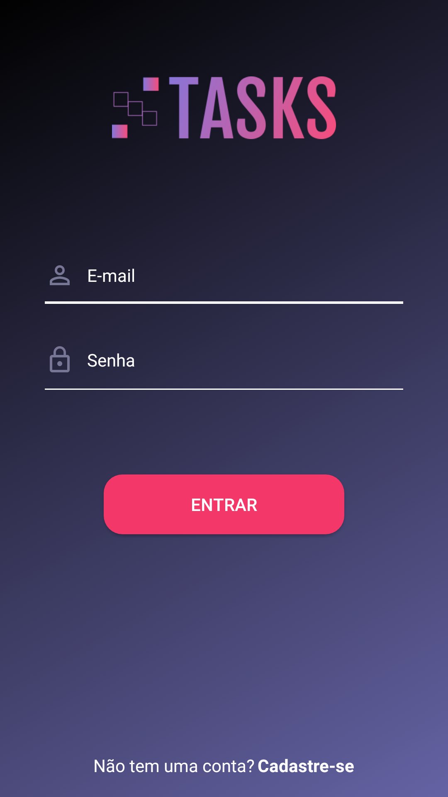
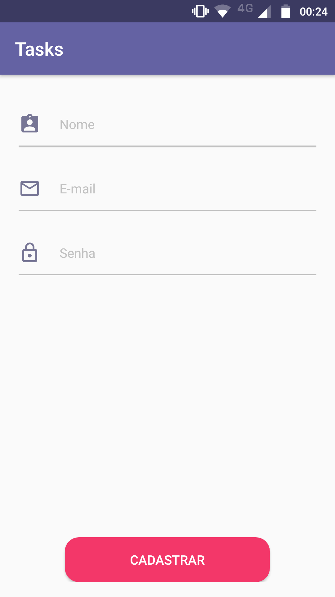
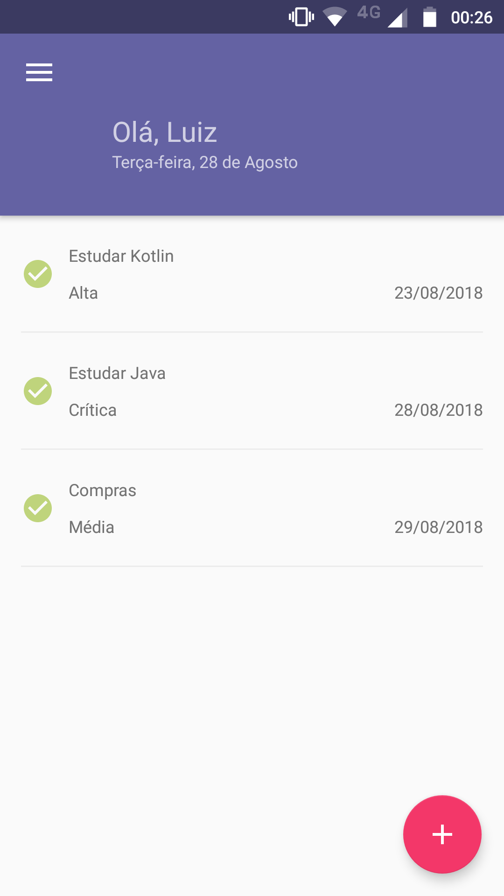
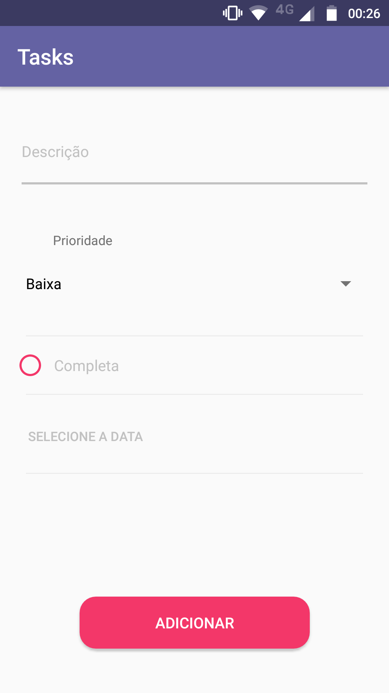
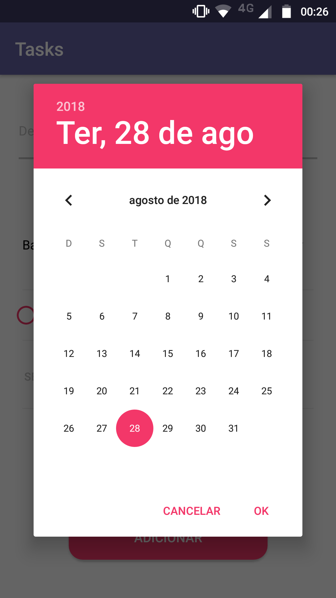

# Introdução

Esse aplicativo tem a finalidade de cadastrar e gerenciar tarefas do dia-a-dia.

# Sobre o build

O app foi criado com a utilização das seguintes ferramentas:

Para o backend:
- Java;
- Kotlin;
- Banco SQLite;

Para o frontend:
- XML p/ Android;
- Noções de UX;

# Compatibilidade

- Este aplicativo é compatível desde a versão do Android 4.0 Ice Cream Sandwich (API 15) até a versão do Android 8.1 Oreo (API 28).

# Download

- Arquivo APK para download:

http://luizhonoratodev.com.br/apps/tasks.apk

# Screenshots

